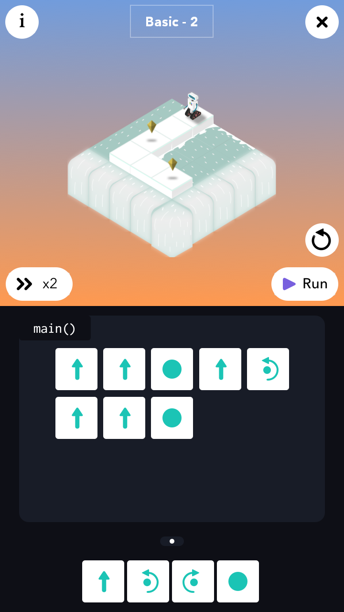
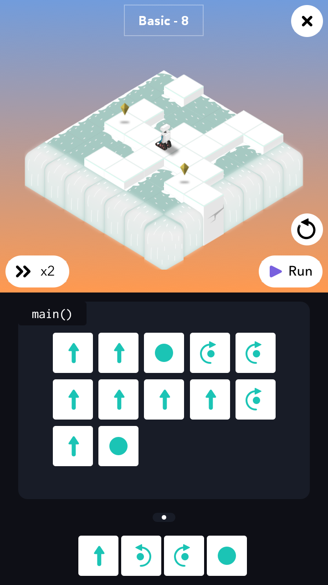

# 1 - The Basic

<table border=0 align="center">
    <tr align="center" valign="middle">
        <td>
            
        </td>
        <td>
            
        </td>
    </tr>
    <tr align="center" valign="middle">
        <td>
            <h3>Basic - 1</h3>
        </td>
        <td>
            <h3>Basic - 2</h3>
        </td>
    </tr>
    <tr align="center" valign="middle">
        <td>
            
        </td>
        <td>
            
        </td>
    </tr>
    <tr align="center" valign="middle">
        <td>
            <h3>Basic - 3</h3>
        </td>
        <td>
            <h3>Basic - 4</h3>
        </td>
    </tr>
    <tr align="center" valign="middle">
        <td>
            
        </td>
        <td>
            
        </td>
    </tr>
    <tr align="center" valign="middle">
        <td>
            <h3>Basic - 5</h3>
        </td>
        <td>
            <h3>Basic - 6</h3>
        </td>
    </tr>
    <tr align="center" valign="middle">
        <td>
            
        </td>
        <td>
            
        </td>
    </tr>
    <tr align="center" valign="middle">
        <td>
            <h3>Basic - 7</h3>
        </td>
        <td>
            <h3>Basic - 8</h3>
        </td>
    </tr>
    <tr align="center" valign="middle">
        <td>
            
        </td>
        <td>
            
        </td>
    </tr>
</table>
