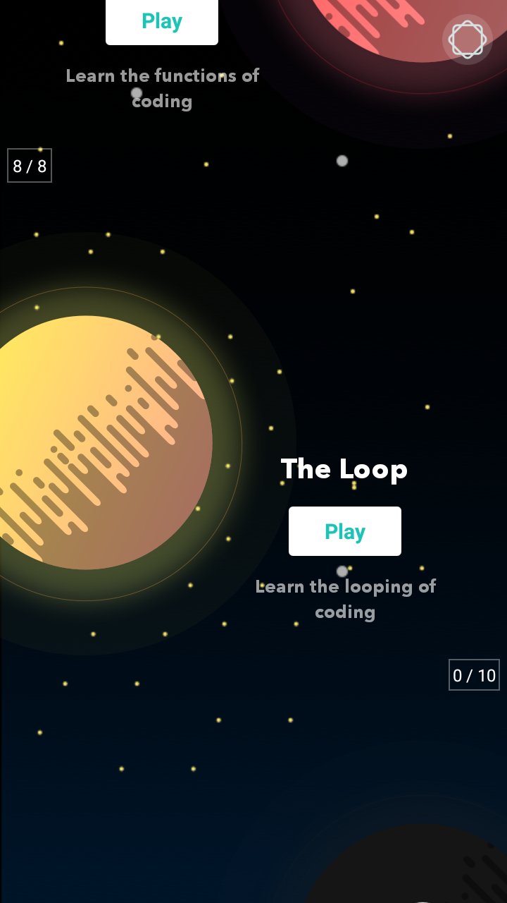
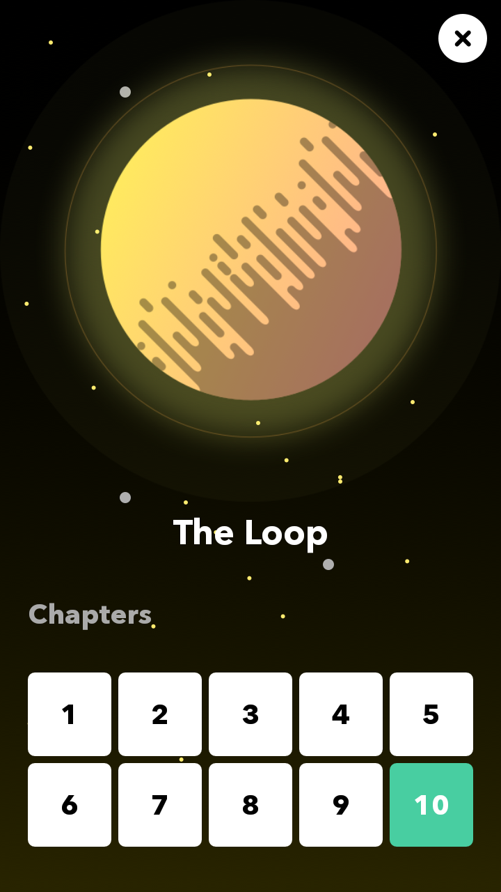
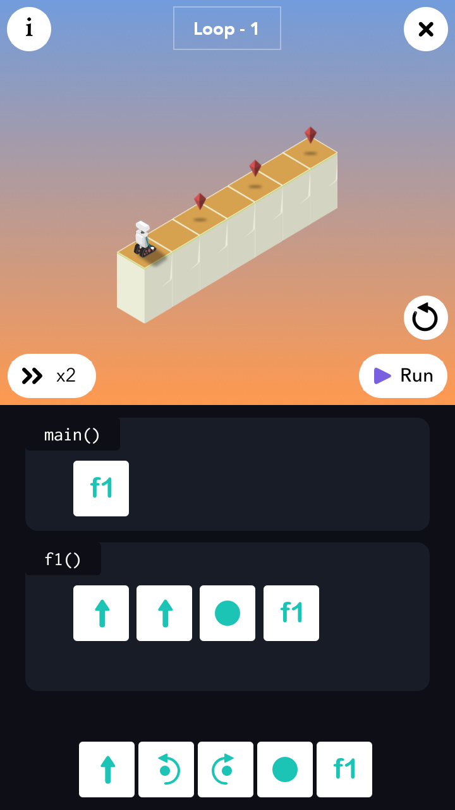
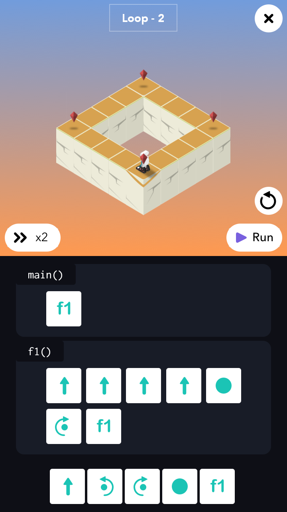

# 3 - The Loop

<table border=0 align="center">
    <tr align="center" valign="middle">
        <td>  </td>
        <td>  </td>
    </tr>
    <tr align="center" valign="middle">
        <td> <h3>Loop - 1</h3> </td>
        <td> <h3>Loop - 2</h3> </td>
    </tr>
    <tr align="center" valign="middle">
        <td>  </td>
        <td>  </td>
    </tr>
</table>
